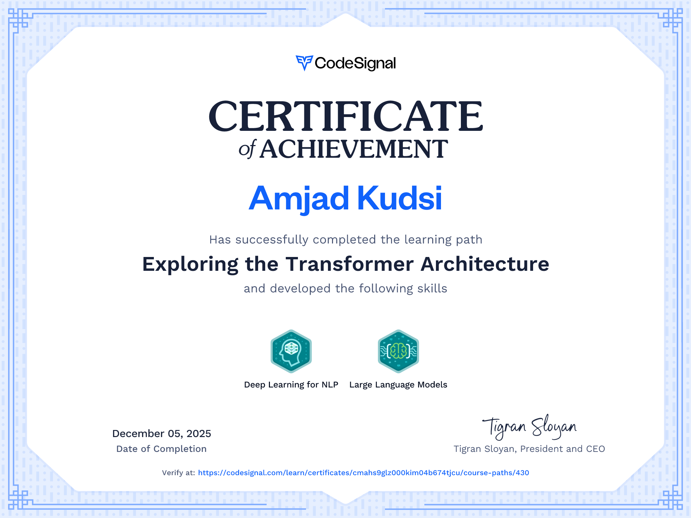

Deep dive into the Transformer Architecture, tracing the evolution from RNNs to Transformers by building attention and full Transformer models from scratch, leveraging Hugging Face to fine-tune and deploy state-of-the-art NLP—gaining both core understanding and real-world skills.

